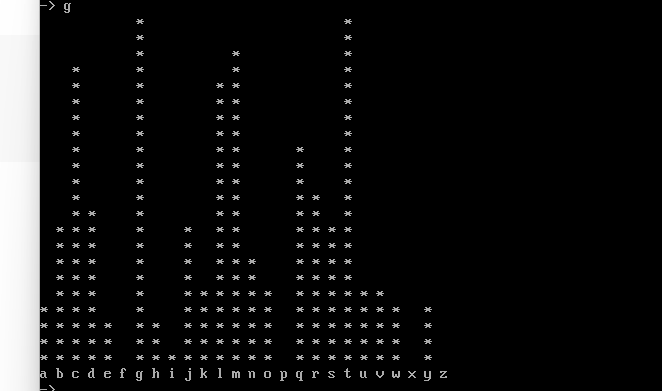
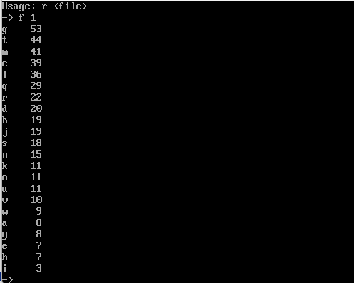
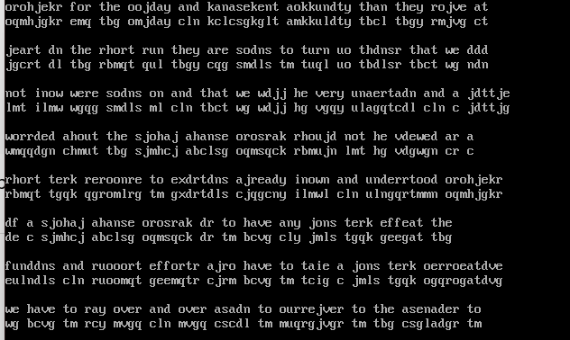
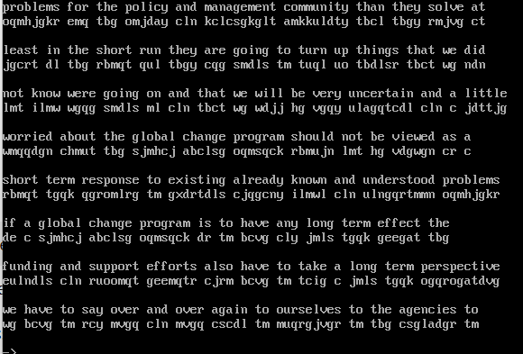
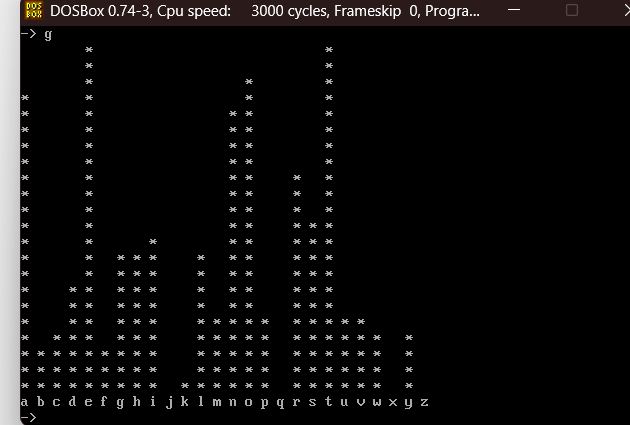
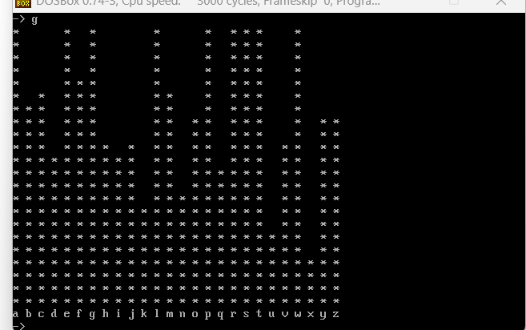
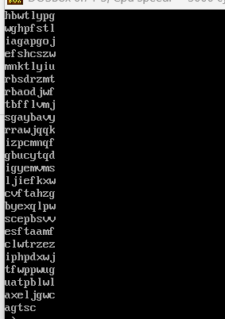

# Task 1 — Classical Cipher Cryptanalysis (Krypto Workbench)

Cryptanalysis exercise breaking two unknown ciphertexts (a monoalphabetic substitution cipher and a Vigenère cipher) using the Krypto cryptanalysis workbench, without prior knowledge of the encryption method or key.

## 📋 Part (a) — Monoalphabetic Substitution Cipher (Ctext-1)

**Step 1 — Load the ciphertext and generate a frequency distribution:**

The ciphertext was loaded into Krypto with the `r` command, then a letter frequency graph was generated:

The exact frequency counts (via the `f` command) confirmed `g` as the most frequent letter, occurring 53 times:

**Step 2 — Map high-frequency letters to English's expected order:**

Since `g` was by far the most frequent ciphertext letter, it was mapped to English's most common letter, `E`. Subsequent ciphertext letters were mapped against the standard English frequency order:

E T A O I N R S H ← highest frequency

**Step 3 — Refine using word patterns:**

Applying the initial letter mappings revealed common English function words emerging (`the`, `they`, `to`), which were used to lock in further substitutions:

**Step 4 — Iterative refinement:**

Remaining substitutions were determined through contextual and grammatical analysis rather than guesswork — testing candidate mappings against the whole document, keeping ones that improved global readability, and reverting (via Krypto's undo function) any that created contradictions. Example resolved mappings:

orobleks → problems

ahanse → change

soins → going

**Step 5 — Final cleanup:**

A remaining inconsistency was corrected (`than` → `that`), confirming the complete, consistent monoalphabetic key. Final recovered plaintext:

The recovered plaintext's own frequency graph was checked for consistency:

**Result:** full substitution key recovered — see [`Key-1.txt`](./Key-1.txt) and [`Ptext-1.txt`](./Ptext-1.txt).

---

## 📋 Part (b) — Vigenère Cipher (Ctext-2)

**Step 1 — Identify the cipher type:**

Ctext-2's frequency graph showed a **flattened distribution** — no single letter dominates the way `g` did in Ctext-1 — indicating a polyalphabetic cipher (Vigenère) rather than simple substitution:

**Step 2 — Determine key length via Index of Coincidence (IC):**

The Index of Coincidence was computed for assumed key lengths from 2 to 10:

IC = 0.043 (overall, flat — confirms polyalphabetic)

Key length 8 → average IC = 0.064

A key length of 8 produced an IC closest to English's expected value (≈0.066), confirming **8** as the correct key length.

**Step 3 — Recover the key letter-by-letter:**

For each of the 8 key positions, the corresponding letter subsequence was extracted and its own frequency graph analyzed:

Using the property that in English letter-frequency rankings, `Z` and `A` sit adjacent (`Z` low, `A` high), each subsequence's graph was compared against the expected `E T A O I N R S H` order and shifted accordingly to identify that position's key letter:

Position 0 → A
Position 1 → N
Position 2 → A
Position 3 → L
Position 4 → Y
Position 5 → S
Position 6 → I
Position 7 → S

**Result:** recovered 8-letter Vigenère keyword: **`ANALYSIS`** — see [`Key-2.txt`](./Key-2.txt) and [`Ptext-2.txt`](./Ptext-2.txt).

## 🛠️ Tooling

**Krypto** — a classical cryptanalysis workbench used for loading ciphertext (`r`), generating frequency distributions (`g`, `f`), computing Index of Coincidence, and testing/undoing candidate substitutions interactively.

## 🛠️ Files

- **`Ptext-1.txt`**, **`Ptext-2.txt`** — recovered plaintexts
- **`Key-1.txt`** — recovered monoalphabetic substitution mapping (Ctext-1)
- **`Key-2.txt`** — recovered Vigenère keyword: `ANALYSIS` (Ctext-2)

## 🎯 Relevance to Blue Team / Security

This exercise builds core cryptanalytic reasoning — recognizing cipher types from statistical signatures (flat vs. peaked frequency distributions), using the Index of Coincidence to fingerprint key length, and systematic hypothesis testing/refinement. These are foundational skills for evaluating cryptographic weaknesses and understanding why modern ciphers are specifically designed to eliminate the statistical patterns that make classical ciphers breakable.
