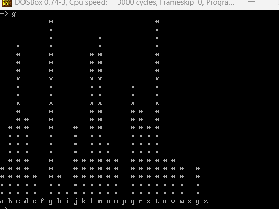
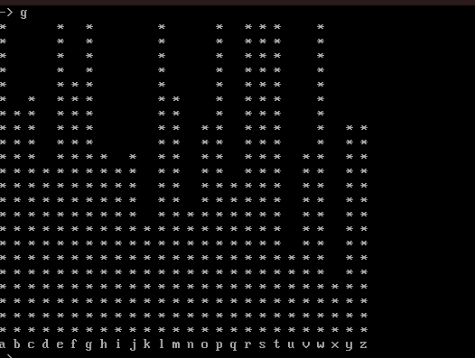
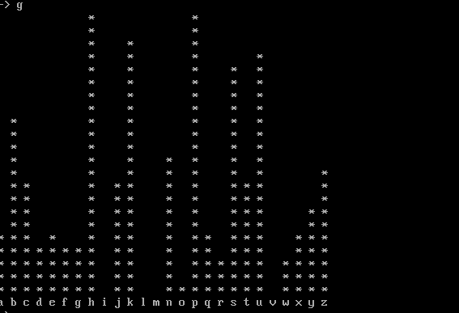

# Task 4 — Flipped Kamasutra Cipher (Java) + Statistical Cryptanalysis Comparison

Java implementation of the flipped Kamasutra cipher — a classical monoalphabetic substitution cipher based on fixed, randomly-generated letter pairings — followed by a statistical comparison against the earlier monoalphabetic (Ctext-1) and Vigenère (Ctext-2) ciphertexts.

## 📋 Overview

The Kamasutra cipher works by randomly pairing up all 26 letters into 13 pairs; encryption and decryption are the *same* operation — each letter is simply swapped with its paired letter. This implementation:

1. **Generates a random keyfile** — shuffles the alphabet and writes it as 13 adjacent letter pairs
2. **Loads the keyfile** into a pairing map (each letter maps to its partner, and vice versa)
3. **Encrypts/decrypts** by swapping each letter with its paired letter (identical logic both directions, since pairing is symmetric)

## ▶️ Usage

**Compile:**
```bash
make all
```

**Generate a random keyfile:**
```bash
java Kamasutra -k keyfile.txt
```

**Encrypt:**
```bash
java Kamasutra -e keyfile.txt Ptext-1.txt Ctext-3.txt
```

**Decrypt:**
```bash
java Kamasutra -d keyfile.txt Ctext-3.txt Output.txt
```

**Verify correctness:**
```bash
diff Output.txt Ptext-1.txt
```
No output means the decrypted result matches the original plaintext exactly.

## ✅ Verified Correctness

Using the actual generated `keyfile.txt` (`epthjlcgizrbydmxausnvqwfko`, i.e. pairs a↔u, b↔r, c↔g, d↔y, e↔p, f↔w, g↔c, h↔t, i↔z, j↔l, k↔o, m↔x, n↔s, q↔v), independently re-running the cipher logic against `Ptext-1.txt` reproduces `Ctext-3.txt` exactly, and decrypting `Ctext-3.txt` reproduces the original plaintext exactly — confirming the implementation is correct and the encryption is properly reversible.

## 📊 Statistical Comparison — Ctext-1 vs. Ctext-2 vs. Ctext-3

All three ciphertexts were derived from the same underlying English plaintext, using three different classical ciphers, then compared via letter frequency analysis:

**Ctext-1 (monoalphabetic substitution):**



**Ctext-2 (Vigenère):**



**Ctext-3 (flipped Kamasutra):**



### Findings

- **Ctext-1 and Ctext-3** (both monoalphabetic) show **similar non-uniform, peaked** frequency distributions — since each maps individual plaintext letters to fixed ciphertext letters, the underlying English letter-frequency statistics (peaks at common letters like e, t, a) are preserved, just relabeled. The specific peak identities differ since the two ciphers use different mappings, but the *shape* of the distribution is comparable.
- **Ctext-2** (Vigenère) shows a **substantially flatter** distribution — because it cycles through multiple substitution alphabets, it spreads each plaintext letter's frequency across several ciphertext letters, meaningfully resisting simple frequency analysis.
- **Conclusion:** despite the Kamasutra cipher's large theoretical keyspace (the number of ways to pair 26 letters), it is structurally just another monoalphabetic substitution — it does not meaningfully increase resistance to frequency analysis compared to a standard substitution cipher.

## 🔓 Cracking the Kamasutra Cipher Without the Key

Since the flipped Kamasutra cipher is fundamentally monoalphabetic, it can be broken using the same classical cryptanalysis techniques as any substitution cipher, without ever needing the keyfile:

1. Generate a frequency distribution of Ctext-3 and compare against expected English letter frequencies (e, t, a, o as the most common)
2. Refine the mapping using common digrams/trigrams (`th`, `he`, `ing`)
3. Exploit the Kamasutra cipher's pairing structure — since each mapping is applied consistently throughout the message, once a handful of letter pairs are recovered, the rest of the plaintext becomes progressively easier to recover using word boundaries and grammatical structure
4. The majority of the plaintext can be recovered this way without ever accessing the keyfile

**Conclusion:** the flipped Kamasutra cipher's large keyspace does not translate into real security — it preserves the same plaintext letter-frequency statistics as any monoalphabetic substitution cipher, making it vulnerable to standard frequency analysis despite its implementation complexity.

## 🛠️ Files

- **`Kamasutra.java`** — cipher implementation (key generation, encrypt/decrypt)
- **`Makefile`** — build automation
- **`Ptext-1.txt`** — plaintext input
- **`Ctext-3.txt`** — generated ciphertext
- **`keyfile.txt`** — generated pairing key
- **`Output.txt`** — decrypted output (verified to match `Ptext-1.txt` exactly)

## 🎯 Relevance to Blue Team / Security

This exercise reinforces a key principle in evaluating cryptographic strength: **keyspace size alone does not indicate real security.** A cipher can have an enormous number of possible keys and still be trivially breakable if it fails to obscure the statistical structure of the underlying plaintext — the same reasoning used to evaluate whether custom or legacy encryption/obfuscation schemes encountered in real investigations provide genuine protection.
