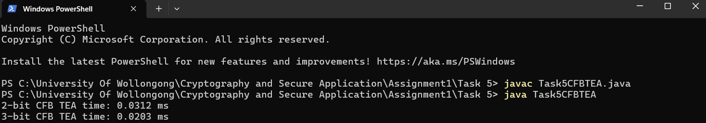

# Task 5 — CFB Mode Encryption with TEA (2-bit vs. c-bit Segment Size)

Java implementation of Cipher Feedback (CFB) mode using the Tiny Encryption Algorithm (TEA), comparing encryption performance between a 2-bit CFB segment size and a student-number-derived c-bit segment size.

## 📋 Overview

**TEA (Tiny Encryption Algorithm)** is a 64-bit block cipher using a Feistel structure with a 128-bit key — this implementation uses TEA's encryption function as the underlying keystream generator for CFB mode (only encryption is needed for CFB, even during decryption, since CFB XORs the keystream with plaintext/ciphertext rather than calling TEA's inverse).

**CFB (Cipher Feedback) mode** turns a block cipher into a stream cipher: instead of encrypting fixed-size blocks directly, a shift register (initialized to the IV) is encrypted with TEA, and only the top `s` bits of that output are used as keystream to XOR against `s` bits of plaintext at a time. The resulting ciphertext bits are fed back into the shift register for the next round — this implementation supports an arbitrary segment size `s`.

**Segment size derivation:** the `c`-bit variant's segment size is derived from the student ID (`8876149`):

Digit sum: 8+8+7+6+1+4+9 = 43
c = 43 mod 5 = 3

So the second variant uses a **3-bit** CFB segment size, compared against a fixed **2-bit** baseline.

## 🔑 Key Parameters

- **Plaintext:** student number `"8876149"`, ASCII-encoded (56 bits)
- **IV:** fixed 64-bit all-zero initialization vector
- **Key:** fixed 128-bit TEA key
- **Segment sizes tested:** 2-bit and 3-bit

## 📊 Results

| Mode | Segment Size | Encryption Time |
|---|---|---|
| CFB | 2-bit | 0.0312 ms |
| CFB | 3-bit | 0.0203 ms |



**Finding:** the 3-bit CFB mode consistently encrypts faster than the 2-bit mode. This is because CFB processes `s` bits per TEA encryption call — a smaller segment size means more iterations (and therefore more full TEA encryption calls) are needed to process the same plaintext, directly increasing execution time. Increasing the segment size improves throughput without affecting the correctness of the CFB mode itself — both variants correctly encrypt the same plaintext using TEA as the underlying block cipher.

**Note:** as per the assignment's focus, only execution time was recorded and compared — ciphertext output itself was not analyzed, since Task 5's objective was performance comparison between segment sizes rather than cryptanalysis of the output.

## ▶️ Usage

**Compile:**
```bash
javac Task5CFBTEA.java
```

**Run:**
```bash
java Task5CFBTEA
```

The program internally encrypts the student number using both 2-bit and 3-bit CFB TEA, printing the measured execution time for each.

## 🛠️ Files

- **`Task5CFBTEA.java`** — TEA block cipher + CFB mode implementation (both segment sizes), with built-in timing

## 🎯 Relevance to Blue Team / Security

Understanding CFB mode's mechanics — segment size trade-offs, IV handling, and why block ciphers can be adapted into stream ciphers — is directly relevant to evaluating real-world cryptographic implementations for correctness and performance characteristics. Recognizing that smaller CFB segment sizes trade throughput for finer-grained error propagation control (a smaller segment size limits how much ciphertext corruption spreads on bit errors) is a practical consideration when reviewing or selecting encryption modes in security architecture.

## ⚠️ Note

This implementation uses a **fixed all-zero IV** and a **fixed hardcoded key**, which is acceptable for this timing-comparison exercise but is not secure practice for real systems — a real CFB implementation must use a unique, unpredictable IV per encryption to avoid keystream reuse vulnerabilities.
