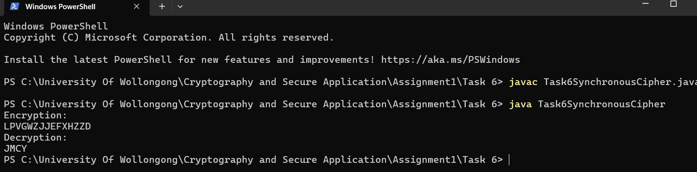

# Task 6 — Synchronous Stream Cipher (Fibonacci Keystream)

Java implementation of a modular synchronous stream cipher, where the keystream is generated using a Fibonacci-style recurrence seeded by a single numeric key.

## 📋 Overview

**Alphabet mapping:** letters A–Z map to integers 0–25; all arithmetic is performed modulo 26.

**Keystream generation** (Fibonacci-style recurrence), given key `k`:

k₁ = k (mod 26)
k₂ = k + 1 (mod 26)
kᵢ = (kᵢ₋₁ + kᵢ₋₂) (mod 26) for i ≥ 3

Each keystream value depends on the two preceding values — the same structure as the Fibonacci sequence, just reduced modulo 26.

**Encryption rule**, for plaintext `m = m₁m₂...mₜ`:

cᵢ = (mᵢ + kᵢ) (mod 26)


**Decryption** regenerates the identical keystream (since it's a *synchronous* stream cipher — the keystream depends only on the key, not on prior ciphertext) and reverses the operation:

mᵢ = (cᵢ - kᵢ) (mod 26)

adding 26 if the result is negative, since modular addition is invertible by modular subtraction.

## 🔑 Verified Examples

**Encryption** — `"I LOVE WOLLONGONG"` with key `k = 3`:

Spaces are removed before processing: `ILOVEWOLLONGONG`

Resulting ciphertext:

LPVGWZJJEFXHZZD


**Decryption** — ciphertext `"MQJJ"` with the same key `k = 3`:

Resulting plaintext:

JMCY


Both results were independently re-verified by re-implementing the algorithm — encryption and decryption are confirmed correct, and encrypting then decrypting the same message with the same key correctly round-trips back to the original plaintext.



## ▶️ Usage

**Compile:**
```bash
javac Task6SynchronousCipher.java
```

**Run:**
```bash
java Task6SynchronousCipher
```

The program encrypts `"I LOVE WOLLONGONG"` and decrypts `"MQJJ"`, both using key `3`, printing the results.

## 🛠️ Files

- **`Task6SynchronousCipher.java`** — keystream generation, encryption, and decryption implementation

## 🎯 Relevance to Blue Team / Security

Understanding synchronous stream ciphers — where the keystream depends solely on the key and not on ciphertext feedback — is relevant to recognizing their key properties in real systems: synchronous stream ciphers require the sender and receiver to stay perfectly synchronized (a single dropped or corrupted bit desynchronizes decryption entirely), unlike self-synchronizing modes such as CFB. This distinction matters when evaluating why a particular stream cipher mode was chosen in a real protocol, and what failure modes (e.g. bit-flipping attacks, synchronization loss) are relevant to each.
