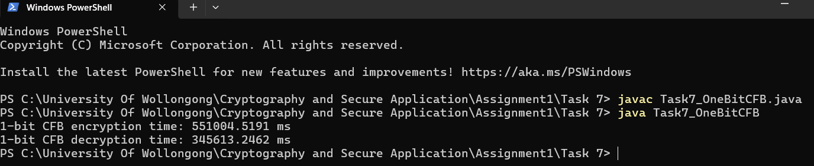
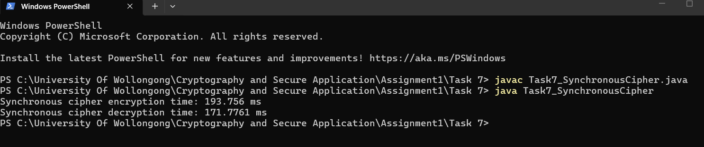
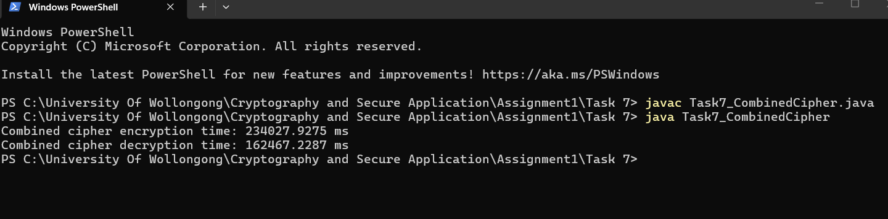

# Task 7 — "Take the Best of Two": 1-bit CFB vs. Synchronous Cipher vs. Combined

Performance comparison of three encryption approaches on a large (200 MB) file: 1-bit CFB mode using TEA, the Fibonacci-keystream synchronous stream cipher (from Task 6), and a hybrid "combined cipher" that alternates between the two per byte — demonstrating the real-world performance cost of fine-grained block cipher feedback modes at scale.

## 📋 Overview

**1-bit CFB (TEA):** extended from Task 5's 2-bit CFB implementation down to a 1-bit feedback size. Because the feedback size is just one bit, a **full 32-round TEA encryption must be performed separately for every single bit of plaintext** — for a 200 MB file, that's over 1.6 billion individual TEA encryptions.

**Synchronous cipher:** the Fibonacci-recurrence stream cipher from Task 6, extended to operate byte-wise across the full file — each byte's keystream value is generated via simple modular addition (`ks[i] = ks[i-1] + ks[i-2]`) and XORed with the plaintext byte. No block cipher calls are needed at all.

**Combined cipher ("take the best of two"):** alternates between the two methods per byte — **even-indexed bytes** use the fast synchronous cipher, **odd-indexed bytes** use 1-bit CFB TEA. This halves the number of expensive TEA calls compared to pure 1-bit CFB, while still retaining feedback-based encryption for half the data.

## 📊 Results (200 MB binary file)

| Cipher Method | Encryption Time | Decryption Time |
|---|---|---|
| 1-bit CFB (TEA) | 551,004 ms (≈ 9.2 minutes) | 345,613 ms (≈ 5.8 minutes) |
| Synchronous Cipher | 193.756 ms | 171.776 ms |
| Combined Cipher | 234,027.93 ms | 162,467.23 ms |

**1-bit CFB TEA:**


**Synchronous cipher:**


**Combined cipher:**


## 🔍 Analysis

- **1-bit CFB is dramatically slower** — roughly **2,850× slower** than the synchronous cipher for encryption. This is a direct consequence of feedback size: every single bit requires a full 32-round TEA block cipher call, so processing 1.6+ billion bits for a 200 MB file means over a billion expensive block cipher operations.
- **The synchronous cipher is extremely fast** — since keystream generation is just simple modular addition per byte (no block cipher calls at all), encrypting the entire 200 MB file takes well under a second.
- **The combined cipher lands in between, closer to the synchronous cipher** — since only half the bytes (odd-indexed) require the expensive 1-bit CFB/TEA path, encryption time (~234 seconds) is roughly **58% faster than pure 1-bit CFB**, while still being far slower than the pure synchronous cipher, since the remaining TEA-based half dominates the cost.
- Interestingly, **combined cipher decryption (162,467 ms) was faster than its own encryption (234,028 ms)** and even faster than 1-bit CFB decryption alone — consistent with normal system/JIT warm-up variance between runs rather than an algorithmic difference, since encryption and decryption perform structurally identical work in this implementation.

## ✅ Conclusion

This experiment demonstrates a practical performance/design trade-off: fine-grained feedback modes like 1-bit CFB offer strong per-bit error propagation properties but are **impractically slow for bulk data** on typical hardware, while simple stream ciphers are extremely fast but rely on weaker keystream generation (pure arithmetic recurrence, easily distinguished/predicted, unlike a block-cipher-driven keystream). The combined cipher illustrates a middle-ground design pattern — mixing a fast, weaker method for part of the data with a slower, stronger method for the rest — trading off performance against cryptographic strength.

## ▶️ Usage

**Compile:**
```bash
javac GenerateBigFile.java
javac Task7_OneBitCFB.java
javac Task7_SynchronousCipher.java
javac Task7_CombinedCipher.java
```

**Run (in order):**
```bash
java GenerateBigFile          # Step 1: generates 200 MB bigfile.bin
java Task7_OneBitCFB          # Step 2: 1-bit CFB encrypt/decrypt timing
java Task7_SynchronousCipher  # Step 3: synchronous cipher encrypt/decrypt timing
java Task7_CombinedCipher     # Step 4: combined cipher encrypt/decrypt timing
```

**Note:** 1-bit CFB mode is intentionally slow and may take several minutes to complete on a 200 MB file — this is expected and is the point of the experiment.

## 🛠️ Files

- **`GenerateBigFile.java`** — generates a 200 MB file of random bytes for performance testing
- **`Task7_OneBitCFB.java`** — 1-bit CFB mode using TEA
- **`Task7_SynchronousCipher.java`** — byte-wise Fibonacci-keystream synchronous cipher
- **`Task7_CombinedCipher.java`** — hybrid cipher alternating between the two per byte

*(`bigfile.bin` itself is not included — regenerate it locally using `GenerateBigFile.java` before running the other programs.)*

## 🎯 Relevance to Blue Team / Security

This exercise demonstrates a real-world engineering trade-off directly relevant to evaluating cryptographic system design: stronger feedback/error-propagation properties often come at a steep performance cost at scale, which is why production systems favor modes like CTR or GCM (parallelizable, efficient) over naive small-segment CFB for bulk encryption. Recognizing this trade-off is useful when auditing why a particular cipher mode was chosen in a system, or when performance constraints might have pushed a real implementation toward a weaker but faster scheme — a common root cause of exploitable cryptographic weaknesses in production systems.
