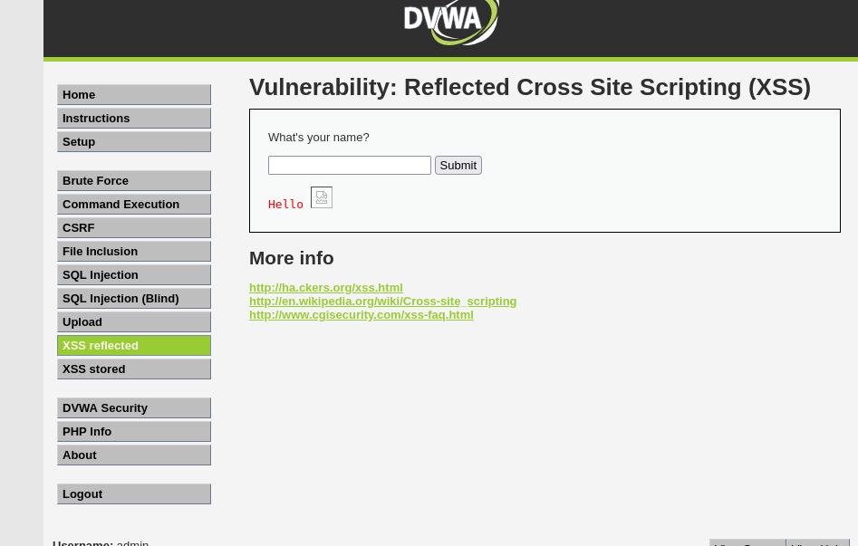
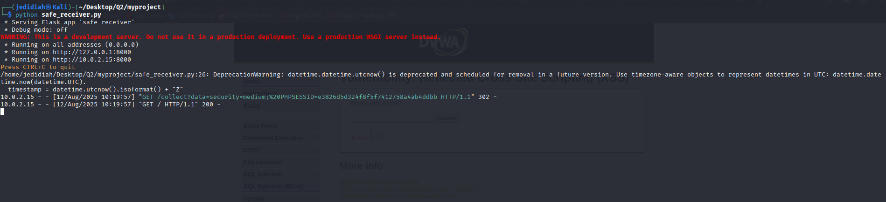
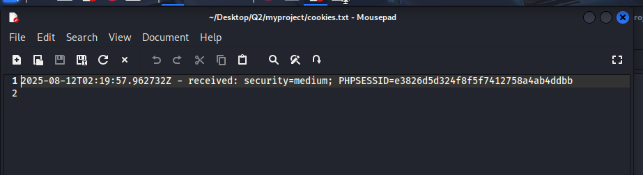

# Reflected XSS — Cookie Exfiltration (DVWA)

Coursework assignment demonstrating a reflected Cross-Site Scripting (XSS) attack against DVWA (Damn Vulnerable Web Application), exfiltrating a victim's session cookie to an attacker-controlled listener.

## 📋 Overview

Reflected XSS occurs when user-supplied input is echoed back into a page's HTML without proper sanitization, allowing an attacker to inject and execute arbitrary JavaScript in the victim's browser. This demonstration:

- Sets up a lightweight Flask "receiver" server to simulate an attacker-controlled endpoint that logs incoming data
- Injects a malicious payload into DVWA's Reflected XSS input field, using an `` tag's `onerror` handler to trigger JavaScript execution without needing a valid image
- The payload silently sends the victim's `document.cookie` (session cookie) to the attacker's listener via a background image request
- Confirms successful exfiltration by checking the logged cookie value on the receiver side

## 🛠️ Environment

- **Target:** DVWA (Damn Vulnerable Web Application), security level set to "medium"
- **Attacker listener:** Kali Linux running a local Flask server
- **Payload delivery:** Reflected XSS input field in DVWA

## ▶️ Usage

1. Install dependencies: `pip install flask`
2. Start the receiver: `python safe_receiver.py` (listens on port 8000)
3. In DVWA, set security to "medium" and navigate to XSS (Reflected)
4. Submit the payload from `payload.txt` into the input field (update the IP inside the payload to match your Kali VM's IP first)
5. Check `cookies.txt` — the victim's session cookie will be logged with a timestamp

## 🛠️ Files

- **`safe_receiver.py`** — Flask server that receives and logs exfiltrated cookie data, with input escaping applied before writing to the log file
- **`payload.txt`** — the reflected XSS payload, using an `onerror` event handler to execute JavaScript that exfiltrates `document.cookie`
- **`cookies.txt`** — output log of captured cookie values

## 📊 Results

Successfully injected the payload into DVWA's Reflected XSS field and confirmed the victim's browser executed the injected JavaScript, sending its session cookie (`PHPSESSID`) to the Flask receiver. The receiver correctly logged the exfiltrated cookie with a timestamp, confirming the full attack chain worked end-to-end — from injection, through execution, to exfiltration and capture.

## 🎯 Relevance to Blue Team / Security

Understanding cookie-stealing XSS from the attacker's perspective directly supports blue team detection and defence: recognizing suspicious outbound requests to unfamiliar endpoints in web/proxy logs, understanding why `HttpOnly` cookie flags exist (they would have blocked `document.cookie` access entirely), and knowing what input sanitization/output encoding failures look like when reviewing application code or WAF alerts.

## ⚠️ Disclaimer

This was performed exclusively against DVWA, a deliberately vulnerable application designed for security training, in an isolated lab environment. Never test XSS or cookie exfiltration techniques against applications you do not own or have explicit authorization to test.
