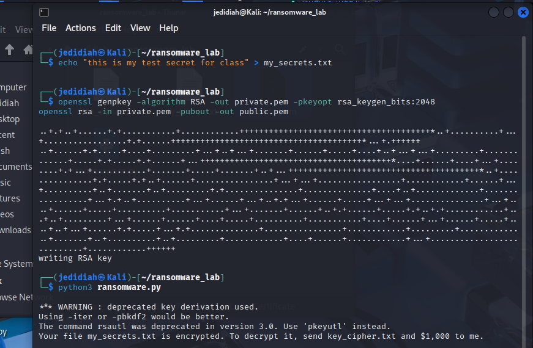
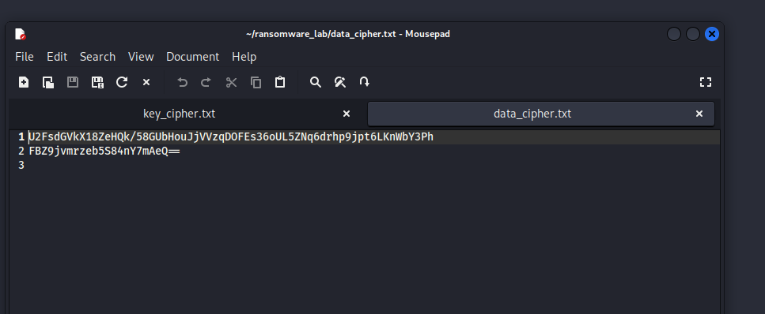
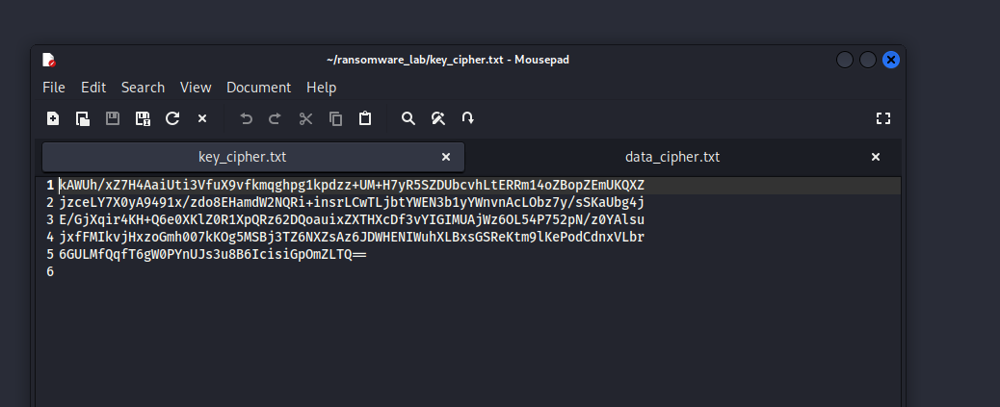

# Ransomware Simulation — Hybrid Encryption Lab

Coursework assignment implementing a simplified ransomware simulation, demonstrating the hybrid encryption scheme real ransomware uses to encrypt victim files and hold the decryption key for ransom.

## 📋 Overview

Modern ransomware typically uses **hybrid encryption**: a fast symmetric cipher (e.g. AES) encrypts the actual victim data, while a slower asymmetric cipher (e.g. RSA) encrypts the symmetric key itself — this means only the attacker (holding the RSA private key) can recover the symmetric key needed to decrypt the victim's files. This simulation implements that exact pattern:

1. Generates a random 16-byte AES symmetric key
2. Encrypts the target file (`my_secrets.txt`) using AES-128-CBC with that key
3. Encrypts the symmetric key itself using the attacker's RSA public key
4. Deletes the original plaintext file, the plaintext symmetric key, and the public key — leaving the victim with only the encrypted data and encrypted key
5. Displays a ransom message instructing the victim to pay for decryption

## 🛠️ Environment

- **Platform:** Kali Linux
- **Tooling:** OpenSSL (for key generation and encryption), Python 3 (orchestration script)

## ▶️ Usage

1. Create a dummy target file:
```bash
   echo "This is a harmless test secret for lab purposes" > my_secrets.txt
```
2. Generate an RSA keypair (simulating the attacker's key infrastructure):
```bash
   openssl genpkey -algorithm RSA -out private.pem -pkeyopt rsa_keygen_bits:2048
   openssl rsa -in private.pem -pubout -out public.pem
```
3. Run the simulation:
```bash
   python3 ransomware.py
```

After running, `my_secrets.txt`, the plaintext symmetric key, and `public.pem` are all deleted, leaving only `data_cipher.txt` (encrypted file) and `key_cipher.txt` (encrypted symmetric key) behind, along with the printed ransom message.

## 🛠️ Files

- **`ransomware.py`** — orchestrates key generation, AES encryption of the target file, RSA encryption of the symmetric key, cleanup of plaintext artifacts, and the ransom message
- **`my_secrets.txt`** — dummy target file simulating a victim's data

## 📊 Results

Successfully executed the full attack chain: the target file was encrypted with a randomly generated AES key, that key was in turn encrypted with RSA, and all plaintext traces (original file, plaintext key, public key) were removed — leaving the victim with only ciphertext and a ransom demand, matching the real-world hybrid encryption pattern used by actual ransomware families.





## 🎯 Relevance to Blue Team / Security

Understanding the hybrid encryption pattern used by ransomware directly informs detection and response: recognizing why decryption without the attacker's private key is computationally infeasible, understanding what artifacts a real ransomware incident leaves behind (encrypted files, deleted originals, ransom notes), and informing backup/recovery strategy design as a defensive countermeasure — since prevention and offline backups are the primary practical defence against this attack pattern.

## ⚠️ Disclaimer

This was performed exclusively in an isolated lab environment against a dummy test file created specifically for this exercise, as part of university coursework. This is a simplified educational simulation, not functional malware — it was never deployed, distributed, or tested against any real system or file. Building or deploying actual ransomware against systems you do not own or have explicit authorization to test is illegal.
