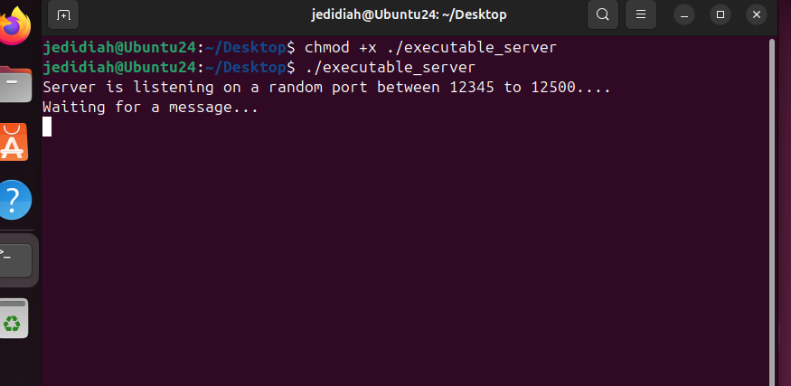
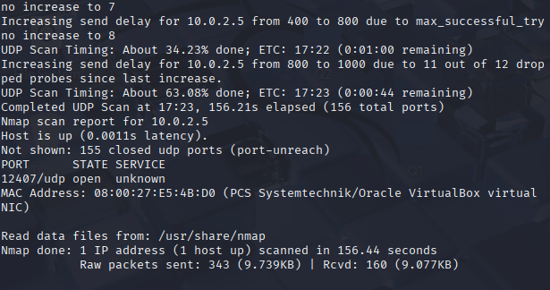
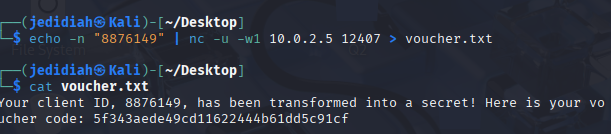
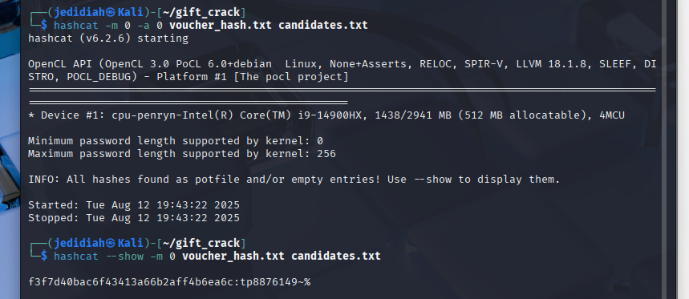

# Voucher Service Exploitation — UDP Enumeration & MD5 Hash Cracking

Coursework assignment involving reconnaissance of a UDP-based network service, extraction of a voucher code, and recovery of unknown format components via password/pattern cracking with Crunch and Hashcat.

## 📋 Overview

The target is a remote voucher-generation service listening on an unknown UDP port, which returns an MD5-hashed voucher code when given a valid client ID. The voucher format was `MD5(A || ClientID || B)`, where `A` and `B` are short unknown strings with restricted character sets. The goal was to:

1. Discover the open UDP port via scanning
2. Interact with the service to obtain a voucher code for a given client ID
3. Recover the unknown values `A` and `B` by generating targeted candidate wordlists and cracking the MD5 hash
4. Manually verify the recovered plaintext reproduces the original hash

## 🛠️ Environment

- **Target:** Remote Linux host running a UDP service on a random port within a known range
- **Attacker:** Kali Linux
- **Tools:** Nmap (UDP port scanning), Netcat (service interaction), Crunch (candidate wordlist generation), Hashcat (hash cracking), AWK (candidate list construction)

## ▶️ Process

**1. Port discovery** — UDP scan across the known port range to locate the service:
```bash
sudo nmap -sU -p 12345-12500 --open -v <target_ip>
```



**2. Voucher retrieval** — sent the client ID to the discovered port and captured the returned MD5 voucher code:
```bash
echo -n "<client_id>" | nc -u -w1 <target_ip> <port>
```


> **Note:** the service returns a freshly generated voucher hash on each request, so the hash captured here differs from the one used in the cracking steps below — both were captured in separate runs of the same process, not a single continuous session.

**3. Candidate generation** — since `A` (2 lowercase letters) and `B` (2 symbols from a restricted set) had known, bounded character sets, used Crunch to generate every possible combination of each, then combined them with the known client ID into a full candidate list:
```bash
crunch 2 2 abcdefghijklmnopqrstuvwxyz -o A.txt
crunch 2 2 symbols.txt -o B.txt
awk -v c="$CLIENT" 'FNR==NR{a[++n]=$0; next} { for (i=1;i<=n;i++) print a[i] c $0 }' A.txt B.txt > candidates.txt
```

**4. Cracking** — ran Hashcat in dictionary mode against the voucher's MD5 hash using the generated candidate list:
```bash
hashcat -m 0 -a 0 voucher_hash.txt candidates.txt
```

**5. Verification** — manually recomputed the MD5 hash of the cracked plaintext to confirm it matched the original voucher hash:
```bash
echo -n "<cracked_plaintext>" | md5sum
```


## 📊 Results

Successfully identified the open UDP port via range scanning, retrieved a voucher code for the target client ID, and recovered the unknown `A` and `B` components by generating a fully bounded candidate space (based on the known character set constraints) and cracking the MD5 hash with Hashcat. Manual re-hashing of the recovered plaintext confirmed an exact match against the original voucher hash, verifying correctness.

## 🎯 Relevance to Blue Team / Security

This exercise demonstrates why weak or predictable hashing schemes (unsalted MD5, small keyspaces for unknown components) are exploitable — directly relevant to reviewing authentication/token generation schemes for weaknesses, understanding why password hashing should use slow, salted algorithms (bcrypt/Argon2, not raw MD5), and recognizing brute-force/dictionary attack patterns (repeated auth attempts, unusual UDP scanning traffic) in network monitoring and SIEM alerting.

## ⚠️ Disclaimer

This was performed exclusively against a lab-provided target system as part of university coursework. Scanning, exploiting, or cracking credentials for systems you do not own or have explicit authorization to test is illegal.
